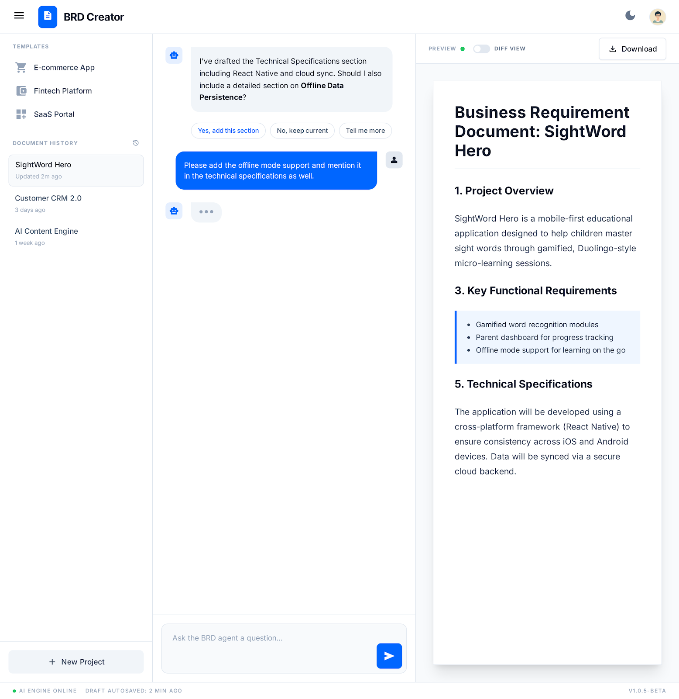

\# BRD Creator (Copilot Agent + Skills)

Create decision-ready Business Requirements Documents (BRDs) using a custom GitHub Copilot agent and skills.

This repo includes:
- A VS Code extension (recommended distribution model)
- A local-only web app (useful for experimentation)

## Screenshots

### VS Code extension dashboard



### Web app dashboard


## What it does

- Guided requirements gathering (asks high-leverage clarifying questions)
- Generates a BRD using a strict, stable Markdown template
- Interactive workflow:
  - Chat on the left
  - BRD preview + versions + diff view on the right
  - Open questions form + “Apply Answers”
  - One-click download to Markdown

## Core building blocks

- Custom agent: [.github/agents/brd-creator.agent.md](.github/agents/brd-creator.agent.md)
- Skills:
  - [.github/skills/brd-gathering/SKILL.md](.github/skills/brd-gathering/SKILL.md)
  - [.github/skills/brd-structuring/SKILL.md](.github/skills/brd-structuring/SKILL.md)

## Prerequisites

- GitHub Copilot subscription
- Copilot CLI installed + authenticated on this machine
- For the web app: Bun installed

## VS Code extension (recommended)

See the extension docs: [vscode-extension/README.md](vscode-extension/README.md)

Quick dev loop:

```bash
cd vscode-extension
npm install
npm run compile
```

Then press F5 to launch the Extension Development Host.

Build a VSIX:

```bash
cd vscode-extension
npm run package
```

The packaged VSIX is copied to the root [releases](releases) folder in this repo.

## Web app (local-only)

See the web app docs: [brd-app/README.md](brd-app/README.md)

```powershell
cd .\brd-app
bun install
bun run .\server.js
```

Open http://localhost:3000

## Output contract (UI ↔ Agent)

The UI expects the agent to return strict JSON (no markdown fences, no commentary):

```json
{
  "mode": "questions" | "brd",
  "versionLabel": "v0.1",
  "changelog": ["..."],
  "brdMarkdown": "...",
  "questions": [
    {"id":"q1","question":"...","context":"...","required":true}
  ]
}
```

## Notes

- Public hosting/serverless deployment is not the intended model for Copilot SDK usage; the extension runs locally with the user’s Copilot authentication.
